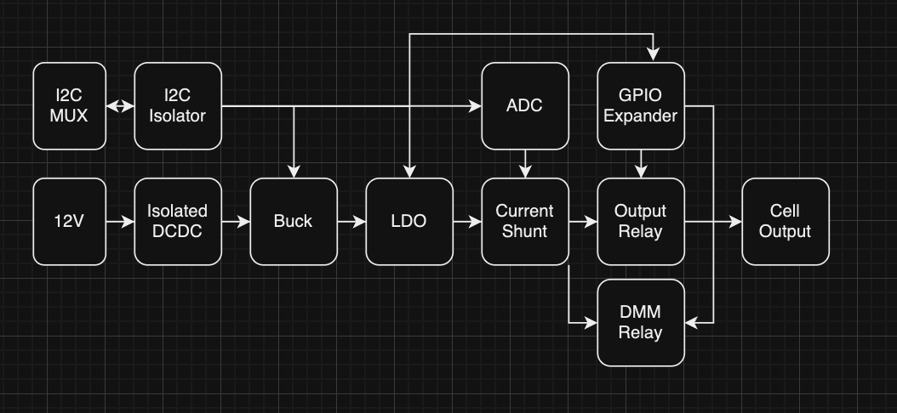
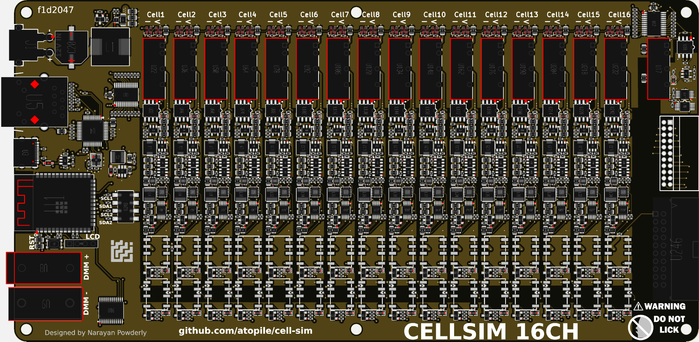
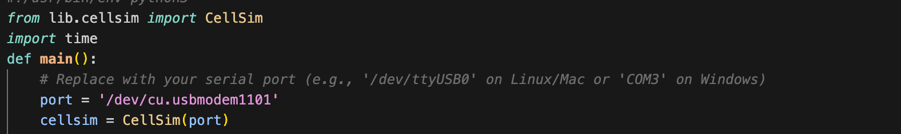
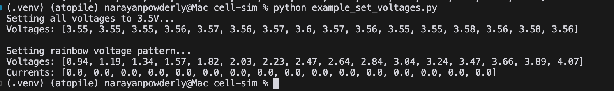
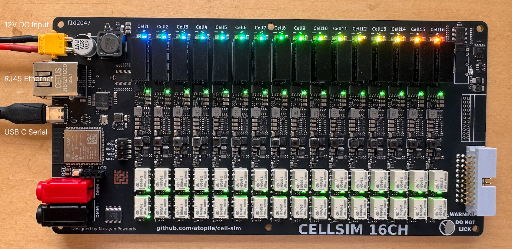

# Cell Simulator

This cell-sim is designed to mimic a LiPo battery pack for develpoment of the surrounding electronics, like a BMS.

- 16 channels
- Open-Source hardware design, you can embed onto your own HIL setup
- ⚡️ 0-5V and 0-500mA per channel
- DMM muxed to each channel for arbitarily precise measurment
- Open-circuit simulation on each channel
- 📏 16bit ADC feedback for voltage and current
- 🔌 USB + 100MBit Ethernet + WiFi w/ Python software interface

## Design overview

## Getting Started

1. install python if you don't have it already
2. install the requirements `pip install -r requirements.txt`
3. connect the board via USB
4. Find the port, something like `/dev/cu.usbmodem1101` on Mac or `COM3` on Windows (look in your device manager)
5. Update the port in example_set_voltages.py

6. Power the board with the 12V input (supply: 1A minimum, 3A recommended)
7. run the example python script `python example_set_voltages.py`
8. Voltages should be set to 3.5V, then rainbow from 1V to 4V across the 16 channels and current should be close to 0A.

You should see something like this:

## Firmware

### Update Firmware
We use PlatformIO to build and upload the firmware via USB.
1. Install PlatformIO: https://platformio.org/install
2. Connect the board via USB (might need to accept connection popup on Mac)
3. Run `pio run -t upload` or install the PlatformIO VSCode extension and use the upload button.

